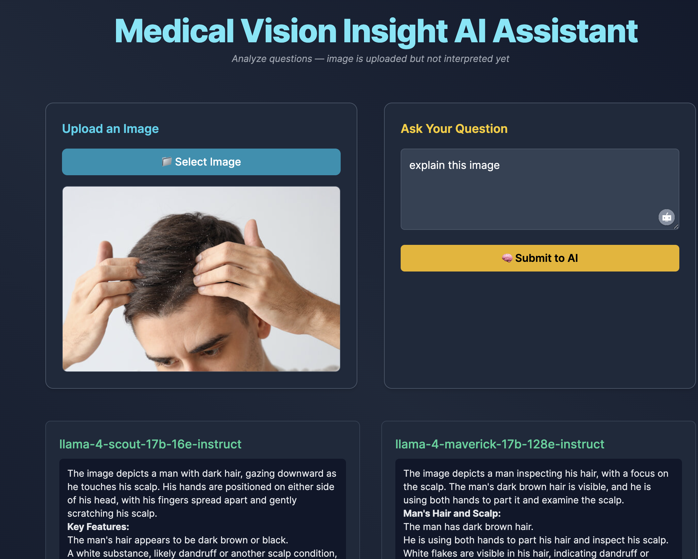

# 🩺 Medical Vision Insight AI Assistant

**Analyze medical-related images and answer questions intelligently using GROQ's LLaMA models.**  
Upload an image, ask a question, and get AI-powered insights in real time.

---

## 📸 Interface Preview


---

## 📂 Project Structure
```
MEDICAL_VISION_INSIGHT_AI_ASSISTANT/
│
├── app.py               # FastAPI application (Web UI)
├── main.py              # CLI tool for image analysis
├── templates/
│   └── index.html       # HTML template for UI
├── static/              # Static assets (CSS, JS)
├── .env                 # Environment variables (GROQ API key)
├── README.md            # Documentation
├── requirements.txt     # Install Dependencies
├── testImg1.jpg         # Sample image for testing
├── testImg2.jpg         # Another sample image
└── interface.png    # UI screenshot for README
```

---

## ✅ Features
- Upload an image and ask a question  
- Analyze images using **GROQ AI LLaMA models**  
- Dual model comparison: `llama-4-scout` and `llama-4-maverick`  
- Web-based UI (FastAPI + Jinja2 Templates)  
- CLI utility for quick image processing  
- Handles invalid images and API errors gracefully  

---

## 🛠 Tech Stack
- **Backend:** FastAPI  
- **Frontend:** Jinja2 Templates  
- **Models:** GROQ LLaMA 4 API  
- **Image Handling:** Pillow (PIL)  
- **Environment Management:** python-dotenv  
- **Logging:** Python logging module  

---

## ⚙️ Installation & Setup

### 1. Clone the Repository
```bash
git clone https://github.com/yourusername/medical-vision-ai.git
cd medical-vision-ai
```

### 2. Create Virtual Environment
```bash
python -m venv venv
source venv/bin/activate    # For Linux/Mac
venv\Scripts\activate       # For Windows
```

### 3. Install Dependencies
```bash
pip install -r requirements.txt
```

### 4. Configure Environment Variables
Create a `.env` file in the root directory:
```ini
GROQ_API_KEY=your_api_key_here
```

---

## 🚀 Running the Application

### Run Web Interface
```bash
uvicorn app:app --host 0.0.0.0 --port 8000 --reload
```
Access the UI at: [http://localhost:8000](http://localhost:8000)

---

### Run Command-Line Tool
Edit `main.py`:
```python
image_path = "testImg1.jpg"
query = "Explain this image"
```

Then run:
```bash
python main.py
```

---

## 🧠 API Details
**Endpoint:**  
`POST /upload_and_query`

**Parameters:**
- `image`: Image file
- `query`: Text question

**Response Example:**
```json
{
  "llama1": "The image depicts a man inspecting his hair...",
  "llama2": "The subject is checking his scalp for dandruff..."
}
```

---

## 🔐 Environment Variables
| Variable       | Description                      |
|---------------|----------------------------------|
| `GROQ_API_KEY`| Your GROQ API key (Required)    |

---

## ✅ Example Output (CLI)
```json
{
  "llama1": "The image depicts a man with dark hair examining his scalp...",
  "llama2": "A man is parting his hair to check for dandruff or scalp condition..."
}
```
---

## 👨‍💻 Author
Developed by [Nouman Ahmad]([https://github.com/yourusername](https://github.com/noumannahmad))
